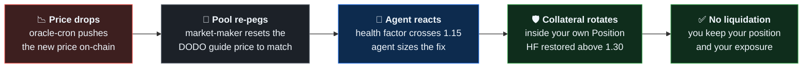

<div align="center">

# Paboxo

### An AI keeper that steps in before you get liquidated — and won't move until it has verified your payment on-chain.

**A money market on [HashKey Chain](https://hashkey.com) mainnet (177).**
Supply and borrow. Borrow across chains over Chainlink CCIP. Pay through HSP to switch on a
non-custodial AI keeper that rotates collateral or repays debt to keep your position alive.

<br/>

[](https://hsk.blockscout.com)
[](https://hsk.blockscout.com/address/0xF0D1c69cc148db2437131a5A736d77FD6fa20B47)
[](https://github.com/paboxo/paboxo-sc/actions/runs/29166135756)
[](https://dorahacks.io/buidl/46993)

**[Live App](https://paboxo.xyz/)** · **[Agent API](https://paboxo-api.staifdev.codes/docs)** ·
**[Indexer](https://hash.staifdev.codes/graphql)** · **[Explorer](https://hsk.blockscout.com)** ·
**[BUIDL](https://dorahacks.io/buidl/46993)**

</div>

---

## The problem

In an on-chain money market you are liquidated the instant your Health Factor crosses the threshold —
usually during a fast price drop, when nobody reacts in time. The penalty goes to the liquidator, not
to you.

**Positions are lost not because the borrower is insolvent, but because they were away from the
keyboard.**

---

## What Paboxo does

Paboxo is an **isolated-pair lending protocol**. `createLendingPool` is a public function: anyone can
open a market for any collateral / borrow pair with its own risk curve — no governance vote, no
allowlist. The only requirement is that both tokens have a registered price feed. Suppliers deposit
the borrow token and earn interest. Borrowers post collateral into a **`Position` contract that
belongs to them alone**.

On top of that sits the part that makes Paboxo different: an **opt-in, non-custodial AI keeper** that
watches your Health Factor and acts *inside your own position* before the liquidator can.

In Paboxo the payment, the AI, and the DeFi mechanic are **one verifiable flow**:

| | |
|---|---|
| 💳 **HSP settlement** | The protection fee is a real on-chain USDC.e payment on mainnet 177, producing a verifiable `ACCEPT` receipt. |
| 🔐 **Payment-gated keeper** | Before touching a position, the keeper re-runs `HSPVerifier` against the signed mandate — payer, recipient, token, chainId. **Payment is a cryptographic precondition for action, not an off-chain flag.** |
| 🛡️ **Non-custodial, simulate-first** | The keeper acts *inside* your position, never takes custody, simulates every action, and runs dry-run by default. |
| 🔗 **Integrated rails** | Cross-chain over Chainlink CCIP. Real DODO V2 liquidity for the swap lever. |

---

## 🟢 Live on HashKey mainnet — verify it yourself

Every core contract is **source-verified on Blockscout**. Every claim below has a link.

### Core contracts (UUPS · AccessControl)

| Contract | Address |
|---|---|
| **LendingPoolFactory** | [`0xF0D1c69c…6fa20B47`](https://hsk.blockscout.com/address/0xF0D1c69cc148db2437131a5A736d77FD6fa20B47) |
| **TokenDataStream** — oracle | [`0x007F735F…190eC20F`](https://hsk.blockscout.com/address/0x007F735Fd070DeD4B0B58D430c392Ff0190eC20F) |
| **IsHealthy** — health & liquidation | [`0xb3B45829…2629a27B`](https://hsk.blockscout.com/address/0xb3B458299864487520d3B0cEDf9F5cfF2629a27B) |
| **InterestRateModel** | [`0x175867CA…f2382E22`](https://hsk.blockscout.com/address/0x175867CAF278eB0610F216F3E0a6E671f2382E22) |
| **CCIP Receiver** | [`0x8ab3650f…536366Ae`](https://hsk.blockscout.com/address/0x8ab3650f02603C97dE6DeAFF927041fC536366Ae) |

### Markets (collateral / pxUSDT)

| Market | Lending pool |
|---|---|
| **pxWHSK** | [`0xB45693e9…08196406`](https://hsk.blockscout.com/address/0xB45693e9F28ceb47fC3c81b45535e3D808196406) |
| **pxWBTC** | [`0xC6FA92Df…b5D17270`](https://hsk.blockscout.com/address/0xC6FA92DfdaBd64e0605e479b5cab3696b5D17270) |
| **pxWETH** | [`0xF1a061Db…b934942D`](https://hsk.blockscout.com/address/0xF1a061Db3C2f3985Faa1Ca178c3cF677b934942D) |

### Receipts, not screenshots

| Claim | Proof |
|---|---|
| 🌉 **Cross-chain works** | [CCIP message, Base → HashKey 177](https://ccip.chain.link/msg/0xad980bdd88ef563baefc3dd54df92a4917af72c1cf23cfbf3395ecf4198f56ab) — `ExecutionStateChanged = SUCCESS`, [destination tx](https://hsk.blockscout.com/tx/0x5332ea136348ff8c8f554f33c99b9a2ccffdadfbc04ea12137e244cb7449df48) |
| 🔄 **The swap lever fires on-chain** | [`repayWithSelectedToken` on the pxWETH market](https://hsk.blockscout.com/tx/0x51ce2af8c21bfdc40f91f0c13693a4433b2bb4afac821294ec718418a61884d4) — 0.028 pxWETH swapped to 50.35 pxUSDT through a real [DODO V2 DPP pool](https://hsk.blockscout.com/address/0xA3f7d5AAFcEACDFA07290Fac97405221a44A72cc) |
| 🤖 **The keeper is running** | [`GET /api/cycles`](https://paboxo-api.staifdev.codes/api/cycles?limit=5) — its live decision log, straight from the keeper |
| ✅ **The contracts pass** | [CI green — 170 tests](https://github.com/paboxo/paboxo-sc/actions/runs/29166135756) |
| 📊 **The indexer is serving** | [`GET /pools`](https://hash.staifdev.codes/pools) — 75 indexed entities over GraphQL + REST |

---

## How it works

A price moves. The protocol notices. The AI acts before the liquidator can.



The same story, call by call — including the HSP gate the keeper cannot skip:

```mermaid
sequenceDiagram
    autonumber
    actor U as 👤 User
    participant FE as paboxo-fe
    participant HSP as 💳 HSP
    participant LP as LendingPool<br/>+ Router
    participant POS as Position<br/>(user-owned)
    participant DEX as DODO V2<br/>DPP
    participant K as ⚙️ Keepers
    participant AI as 🤖 Rebalance Agent

    rect rgb(22, 27, 34)
    Note over U,POS: Open a position
    U->>FE: supply collateral, borrow pxUSDT
    FE->>LP: supplyCollateral() · borrowDebt()
    LP->>POS: deploy & custody collateral
    LP-->>FE: HF = 1.42 ✅
    end

    rect rgb(43, 33, 12)
    Note over U,LP: Pay to protect
    U->>HSP: pay fee in USDC.e — from your own wallet
    HSP-->>U: ACCEPT receipt + decision trace
    U->>LP: approveRebalanceDelegation(keeper)
    end

    rect rgb(45, 27, 27)
    Note over K,DEX: The market moves against you
    K->>LP: setPrice() — collateral drops
    K->>DEX: resetDODOPrivatePool() — re-peg to oracle
    end

    rect rgb(13, 43, 78)
    Note over AI,POS: The agent acts before the liquidator
    AI->>LP: read health factor
    LP-->>AI: HF = 1.09 ⚠️ (below 1.15)
    AI->>HSP: HSPVerifier — re-check the signed mandate
    HSP-->>AI: ✅ ACCEPT — payer, recipient, token, chainId
    AI->>AI: size the fix — deterministic math
    AI->>LP: rebalancePosition() — simulated first
    LP->>POS: rotate collateral
    POS->>DEX: swap at the re-pegged price
    DEX-->>POS: proceeds stay in the Position
    LP-->>AI: HF = 1.31 ✅ restored
    end

    rect rgb(15, 45, 28)
    Note over AI,U: You never got liquidated
    AI->>FE: DGRID explanation — "why I did this"
    FE-->>U: position safe · funds never left
    end
```



---

## 🤖 The Rebalance Agent

> ### The LLM explains the decision. It never makes it.
>
> Every number that moves money — health factor, swap size, which lever to pull — is
> **deterministic scaled-integer math, enforced on-chain**. The language model receives that finished
> decision and is instructed, in its system prompt, that it **must not change it**. Its only job is to
> tell you *why*, in a sentence you can read.
>
> An LLM that can hallucinate prose is useful. An LLM that can hallucinate a swap size is a
> liability. Paboxo gives it the first job and structurally denies it the second.

**Three levers, all constrained on-chain:**

| Lever | What it does | Requires |
|---|---|---|
| **Rotate** | Swaps volatile collateral → stablecoin, via DODO V2 DPP pools | Your on-chain delegation |
| **Deleverage** | Repays part of the debt out of your collateral | Protocol operator |
| **Signal-only** | Warns you, touches nothing — *the default until you delegate* | Nothing |

**How it decides.** Every 60 seconds the agent reads live health factors from `IsHealthy`. A position
is at risk when `1.0 ≤ HF < 1.15`. It sizes an action to restore `HF ≥ 1.30`. Below `1.0` it does
nothing — that position belongs to liquidation, and the agent knows the difference.

**How it stays safe.** Every write, from every keeper, passes through **one mandatory safety guard**:
a dry-run gate, a gas ceiling, a per-cycle action cap, and absolute price bounds. There is no send
path that bypasses it. Every action is **simulated before execution**, and the keeper runs
**dry-run by default** — production execution is a deliberate switch, and for judging safety the demo
runs in verify-and-simulate mode.

Your funds never leave your `Position`. Delegation is one on-chain call
(`approveRebalanceDelegation`); revoking it is another. The keeper cannot move your collateral out,
cannot borrow against it, and cannot touch a position that has not opted in.

**Watch it think:**

```bash
curl https://paboxo-api.staifdev.codes/api/cycles     # every cycle it has run
curl https://paboxo-api.staifdev.codes/api/actions    # every decision, with its plain-language reason
```

Built as a **[Mastra](https://mastra.ai) Workflow** — `buildWatchlist → readHealth → filterAtRisk →
decide → explain → execute → report` — reasoning through **[DGRID AI](https://dgrid.ai/)**. If the
model is unreachable the agent falls back to a deterministic template and keeps running. The loop
never stops because the AI had a bad day.

---

## 💳 HSP — pay to protect, verified on-chain

HSP sits on the protocol's **authorization path**, not as a bolt-on.

1. You click **Enable protection** and pay a fee in **USDC.e** through HSP — a real on-chain
   settlement from your own wallet, zero custody, on mainnet 177.
2. HSP returns a verified **`ACCEPT`** receipt with a decision trace.
3. You grant rebalance-delegation to the keeper on-chain.
4. **The keeper independently re-verifies that receipt** (`HSPVerifier`, bound to the signed mandate)
   before it acts.

The keeper **refuses to protect a position without cryptographic proof of payment**. No subscription
database, no off-chain flag to spoof.

| | |
|---|---|
| Coordinator | `hsp-hackathon.hashkeymerchant.com` |
| Fee token | USDC.e [`0x054ed458…c9D88D0a`](https://hsk.blockscout.com/address/0x054ed45810DbBAb8B27668922D110669c9D88D0a) |
| Adapter | [`0x467AaF35…c1e25012`](https://hsk.blockscout.com/address/0x467AaF355DF243379B961Ce00abBae20c1e25012) |

*HSP is a hackathon sandbox (pre-1.0). The integration is real on mainnet 177; the adapter and
coordinator are the organizer's sandbox deployment.*

---

## 🌉 Cross-chain, over real Chainlink CCIP

Supply into a HashKey pool **from Base**. Borrow pxUSDT that bridges **to another chain**. Burn & mint
pools on both lanes.

Not a bridge we wrote. Not a mock. [Here is the message on the CCIP
explorer](https://ccip.chain.link/msg/0xad980bdd88ef563baefc3dd54df92a4917af72c1cf23cfbf3395ecf4198f56ab)
— `ExecutionStateChanged = SUCCESS`.

| | Chain | Selector |
|---|---|---|
| Home | HashKey Chain | `7613811247471741961` |
| Counterparty | Base | `15971525489660198786` |

---

## ⏱️ 3-minute judge path

1. Open the [live app](https://paboxo.xyz/) and connect a wallet on **HashKey Chain mainnet 177**.
2. Supply collateral and borrow from a Paboxo market.
3. Click **Enable protection** and complete the HSP USDC.e payment.
4. Open the HSP Explorer receipt showing **`ACCEPT`**.
5. Grant **rebalance-delegation**.
6. Watch the keeper verify the mandate + receipt and run a simulated rebalance cycle — with the DGRID
   explanation attached.

---

## 📦 Repositories

| Repo | What's inside | Verify it |
|---|---|---|
| **[paboxo-sc](https://github.com/paboxo/paboxo-sc)** | The protocol. Factory, pools, routers, per-user Positions, health & liquidation, oracles, DODO adapter, CCIP, HSP verifier usage. | `forge test` — **170 passing**, [CI green](https://github.com/paboxo/paboxo-sc/actions/runs/29166135756) |
| **[paboxo-keeper](https://github.com/paboxo/paboxo-keeper)** | The off-chain brain. `ai-workflow` (Rebalance Agent + DGRID + HSP verify gate), `market-maker` (pegs DODO DPP to the oracle), `oracle-cron`, `liquidation-bot`. | `pnpm -r test` |
| **[paboxo-fe](https://github.com/paboxo/paboxo-fe)** | The app. Earn, borrow, swap, portfolio, cross-chain, HSP payment flow + protection panel. | `bun run test` — **428 passing** |
| **[paboxo-indexer](https://github.com/paboxo/paboxo-indexer)** | Every protocol event, queryable. 75 entities over GraphQL + REST. | [Live GraphQL](https://hash.staifdev.codes/graphql) |
| **[paboxo-landingpage](https://github.com/paboxo/paboxo-landingpage)** | The 3D landing experience. | [paboxo.xyz](https://paboxo.xyz/) |

---

## ⚖️ Risk parameters

These are the live values on every market. Don't take our word for it — read them off the chain:

| Parameter | Value | Read it from |
|---|---|---|
| Loan-to-value | **70%** | `LendingPoolRouter.ltv()` |
| Liquidation threshold | **75%** | [`IsHealthy.liquidationThreshold(router)`](https://hsk.blockscout.com/address/0xb3B458299864487520d3B0cEDf9F5cfF2629a27B) |
| Liquidation bonus | **10%** | [`IsHealthy.liquidationBonus(router)`](https://hsk.blockscout.com/address/0xb3B458299864487520d3B0cEDf9F5cfF2629a27B) |
| Interest rate model | Two-slope kinked, per-market | [`InterestRateModel`](https://hsk.blockscout.com/address/0x175867CAF278eB0610F216F3E0a6E671f2382E22) |
| Oracle staleness window | 1 hour — stale prices revert, they never settle | [`TokenDataStream`](https://hsk.blockscout.com/address/0x007F735Fd070DeD4B0B58D430c392Ff0190eC20F) |
| Protocol fee | 0.1% of borrow | [`LendingPoolFactory`](https://hsk.blockscout.com/address/0xF0D1c69cc148db2437131a5A736d77FD6fa20B47) |

```bash
cast call <pool> "router()(address)" --rpc-url https://mainnet.hsk.xyz
cast call <router> "ltv()(uint256)"  --rpc-url https://mainnet.hsk.xyz   # 7e17 = 70%
```

---

## 🔒 Security & limitations

We would rather you read this than discover it.

- **Non-custodial.** The keeper never holds user funds. It acts only inside a position the user
  delegated, and only after an independently-verified HSP `ACCEPT`.
- **Deterministic gates, AI for explanation.** The LLM never controls funds — it explains a decision
  the contracts enforce.
- **Dry-run by default.** Production execution is a deliberate switch. The demo runs in
  verify-and-simulate mode.
- **Not a solvency guarantee.** In an extreme single-block crash the keeper may not prevent
  liquidation. It reduces *avoidable, slow-drift* liquidations — it does not promise to eliminate all
  of them.

---

## 💰 Business model

Paboxo targets borrowers who keep collateralized positions open but cannot monitor liquidation risk
24/7. Monetization is an **opt-in protection fee paid through HSP, per protected position**. Because
the keeper only acts after verifying an on-chain payment, the protocol needs **no off-chain
subscription database**. The same mechanism extends to tiered protection, market-maker-sponsored
protection, or DAO-funded protection for strategic markets.

---

## 🛠️ Tech stack

`Solidity` · `Foundry` · `TypeScript` · `viem` · `Mastra` · `React` · `Vite` · `wagmi` ·
`Ponder` · [`HSP`](https://hashfans.io/) · [`DGRID AI`](https://dgrid.ai/) · `Chainlink CCIP` ·
`DODO V2 DPP` · **HashKey Chain mainnet 177**

---

## 👥 Team

| | Role | GitHub |
|---|---|---|
| **Ghoza** | Architect Engineer | [@ghozzza](https://github.com/ghozzza) |
| **Axel** | Integration Engineer | [@Lexirieru](https://github.com/Lexirieru) |
| **Wildan** | Backend Engineer | [@ahmadstiff](https://github.com/ahmadstiff) |
| **Ahmad** | Frontend Engineer | [@wildanre](https://github.com/wildanre) |

---

<div align="center">
<br/>

**Built for the [HashKey On-Chain Horizon Hackathon](https://dorahacks.io/buidl/46993)** · DeFi + AI track

[Live App](https://paboxo.xyz/) · [BUIDL](https://dorahacks.io/buidl/46993) ·
[Agent API](https://paboxo-api.staifdev.codes/docs) · [Explorer](https://hsk.blockscout.com)

<sub>Markets run on Paboxo-issued <code>px</code> assets on HashKey mainnet 177.</sub>

</div>
